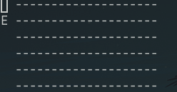

# Guitar notes
A program to help learning notes on the guitar.
Using this program without options will show a random note on a random string every few seconds. This way you will be able to practice how to actually play those notes. 

Adding `--cheatsheet` parameter will print an image showing the fretboard of the guitar and to which note each fret coresponds.

## Additional options

`guitar-notes -p5`

Show a new note every `5` seconds

`guitar-notes -s134`

Show notes only on strings 1, 3 and 4. By default, all strings are shown.

